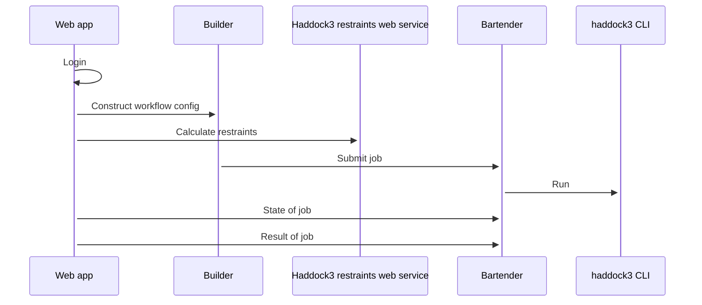
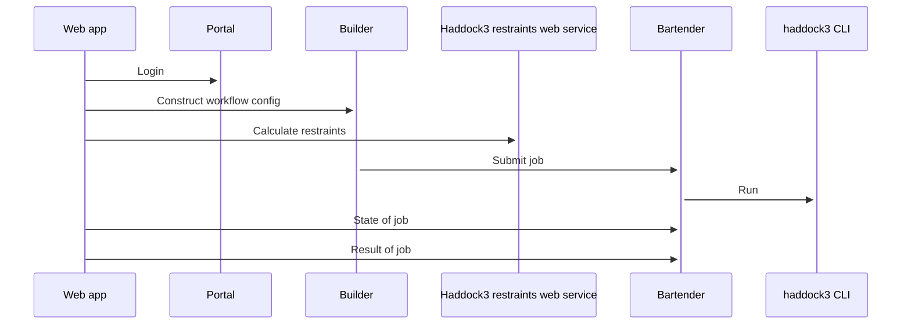

# Web application for haddock3

[](https://research-software-directory.org/software/haddock3-webapp)
[](https://doi.org/10.5281/zenodo.7990850)
[](https://fair-software.eu)
[](https://github.com/i-VRESSE/haddock3-webapp/actions/workflows/ci.yml)

[Haddock3](https://github.com/haddocking/haddock3) (High Ambiguity Driven protein-protein DOCKing) is a an information-driven flexible docking approach for the modeling of biomolecular complexes. This software wraps the the haddock3 command line tool in a web application. The web application makes it easy to make a configuration file, run it and show the results.

Uses

- [bartender](https://github.com/i-VRESSE/bartender) for job execution.
- [workflow-builder](https://github.com/i-VRESSE/workflow-builder) to construct a Haddock3 workflow config file.
- [haddock3](https://github.com/haddocking/haddock3) to compute and
  - Its embedded restraints web service is also used.
- [haddock3-analysis-components](https://github.com/i-VRESSE/haddock3-analysis-components) for analysis components.
- [haddock3-ui](https://github.com/i-VRESSE/haddock3-ui) for reusable UI components.



Or in [portal mode](docs/portal.md):



## Deployment

Deployments with containers are explained in [deploy/README.md](deploy/README.md).

## Setup

The web app is written in [Node.js](https://nodejs.org/) to install dependencies run:

```shell
npm install
```

Configuration of the web application is done via `.env` file or environment variables.
For configuration of authentication & authorization see [docs/auth.md](docs/auth.md).
For configuration of job submission see [docs/bartender.md#configuration](docs/bartender.md#configuration).
For configuration of how to rewrite the submitted workflow file see [docs/reewite.md](docs/reewite.md).
For instructions to run within the BonvinLab computational stuctural biology portal see [docs/portal](docs/portal.md).

Use [.env.example](./.env.example) as a template:

```shell
cp .env.example .env
# Edit .env file
```

Create rsa key pair for signing & verifying JWT tokens for bartender web service with:

```shell
openssl genpkey -algorithm RSA -out private_key.pem \
    -pkeyopt rsa_keygen_bits:2048
openssl rsa -pubout -in private_key.pem -out public_key.pem
```

## Bartender web service

The bartender web service should be running if you want to submit jobs.
See [docs/bartender.md](docs/bartender.md) how to set it up.

## Haddock3 restraints web service

The scenario forms uses the [haddock3 restraints web service](https://github.com/haddocking/haddock3/blob/main/src/haddock/clis/restraints/webservice.py). to calulate restraints based on given active residues and structures.

For the web application to use this service, it needs to be running with

```shell
# Activated Python environment with haddock3, fastapi and uvicorn installed
uvicorn --port 5000 haddock.clis.restraints.webservice:app
```

If not running on `http://localhost:5000` then set the `HADDOCK3_RESTRAINTS_URL` environment variable.

See [docs/scenarios.md](docs/scenarios.md) for more information on how the web application uses the restraints web service.

## Development

### Develop inside devcontainer

You can develop inside a [devcontainer](https://containers.dev/) inside Visual Studio Code. The devcontainer includes all services required by the webapp.

When you exit VS code the containers will keep running, kill by running `docker compose -f .devcontainer/docker-compose.yml -p haddock3-webapp_devcontainer down` in the terminal or in VS Code reopen folder outside container.

### Development outside devcontainer

To develop the webapp ouside a devcontainer you have the following services running:

1. PostgreSQL database for user management
2. [Bartender web service](https://github.com/i-VRESSE/bartender/) for job executation and input/output storage.
3. [Haddock3 restraints web service]() for calculating restraints on scenario pages.

The PostgreSQL database can be started in a container with

```sh
npm run docker:dev
```

(Stores data in a Docker volume)
(You can get a psql shell with `npm run psql:dev`)
(On CTRL-C the database is stopped. To remove container and volume use `npm run docker:devrm`)

The database must be initialized with

```sh
npm run setup
# This will create tables
```

## Start development server

Start [remix](https://remix.run) development server from your terminal with:

```sh
npm run dev
```

This will refresh & rebuild assets on file changes.

## Other development commands

The database setup should be run only once for a fresh database.
Whenever you change the `app/drizzle/schema.server.ts` file you need to run [npm run generate:migration](https://orm.drizzle.team/kit-docs/commands#generate-migrations) to generate a migration, edit generated `app/drizzle/*.sql` file if needed and then run `npm run setup` to apply migration to database.

To format according to [prettier](https://prettier.io) run

```sh
npm run format
```

It's recommended to install an editor plugin (like the [VSCode Prettier plugin](https://marketplace.visualstudio.com/items?itemName=esbenp.prettier-vscode)) to get auto-formatting on save.

To lint according [eslint](https://eslint.org) run

```sh
npm run lint
```

To check the Typescript types run

```sh
npm run typecheck
```

For testing see [docs/testing.md](docs/testing.md).

## Start production server

First, build your app for production:

```sh
npm run build
```

Then run the app in production mode:

```sh
export $(cat .env |grep -v '#' |xargs)
npm start
```

## Stack

The tech stack is explained in [docs/stack.md](docs/stack.md).
