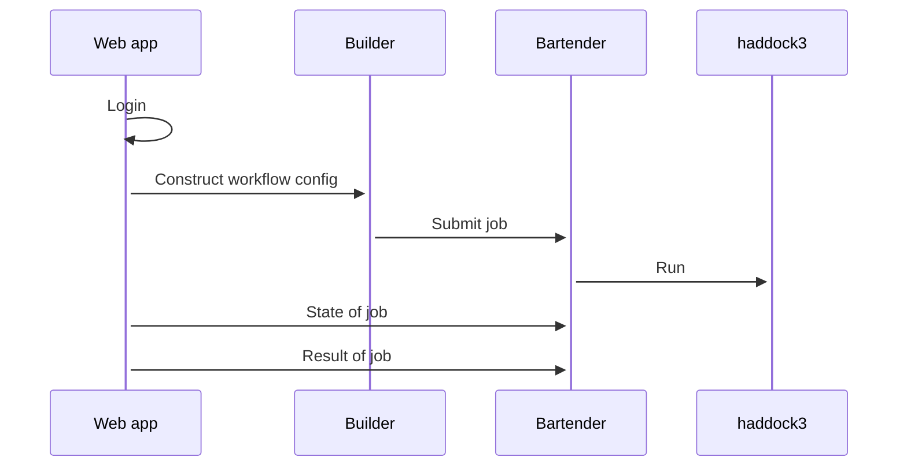

# Web application for haddock3

[](https://research-software-directory.org/software/bartended-haddock3)
[](https://doi.org/10.5281/zenodo.7990850)
[](https://fair-software.eu)

Uses

- [bartender](https://github.com/i-VRESSE/bartender) for job execution.
- [workflow-builder](https://github.com/i-VRESSE/workflow-builder) to construct a Haddock3 workflow config file.
- [haddock3](https://github.com/haddocking/haddock3) to compute



- [Remix Docs](https://remix.run/docs)

## Setup

```shell
npm install
cp .env.example .env
npx prisma db push
npx prisma db seed
# Create rsa key pair for signing & verifying JWT tokens for bartender web service
openssl genpkey -algorithm RSA -out private_key.pem \
    -pkeyopt rsa_keygen_bits:2048
openssl rsa -pubout -in private_key.pem -out public_key.pem
```

## Development

From your terminal:

```sh
npm run dev
```

This starts your app in development mode, rebuilding assets on file changes.

To format according to [prettier](https://prettier.io) run

```sh
npm run format
```

It's recommended to install an editor plugin (like the [VSCode Prettier plugin](https://marketplace.visualstudio.com/items?itemName=esbenp.prettier-vscode)) to get auto-formatting on save.

To lint according [eslint](https://eslint.org) run

```sh
npm run lint
```

To check the Typescript types run

```sh
npm run typecheck
```

To run unit tests (`app/**/*.test.ts`) with [Vitest](https://vitest.dev) use

```sh
# In watch mode
npm run test
# or in single run mode with coverage
npm run test -- run --coverage
```

## Deployment

First, build your app for production:

```sh
npm run build
```

Then run the app in production mode:

```sh
npm start
```

Now you'll need to pick a host to deploy it to.

### DIY

If you're familiar with deploying node applications, the built-in Remix app server is production-ready.

Make sure to deploy the output of `remix build`

- `build/`
- `public/build/`

### Docker

The web application can be run inside a Docker container.

Requirements:

1. [bartender repo](https://github.com/i-VRESSE/bartender) to be cloned in `../bartender` directory.
2. bartender repo should have [.env file](https://github.com/i-VRESSE/bartender/blob/main/docs/configuration.md#environment-variables)
3. bartender repo should have a [config.yaml file](https://github.com/i-VRESSE/bartender/blob/main/docs/configuration.md#configuration-file)

Build with

```sh
docker compose build
```

Run with

```sh
docker compose up
```

Web application running at http://localhost:8080 .

## Authentication & authorization

See [docs/auth.md](docs/auth.md).

## Bartender web service client

This web app uses a client to consume the bartender web service.

The client can be (re-)generated with

```shell
npm run generate-client
```

(This command requires that the bartender webservice is running at http://localhost:8000)

## Bartender web service configuration

The haddock3 web application needs to know where the [Bartender web service](https://github.com/i-VRESSE/bartender) is running.
Configure bartender location with `BARTENDER_API_URL` environment variable.

```sh
BARTENDER_API_URL=http://localhost:8000
```

The haddock3 web application must be trusted by the bartender web service using a JWT token.
An RSA private key is used by the haddock3 web application to sign the JWT token.
To tell the bartender web service where to find the private key, use the `BARTENDER_PRIVATE_KEY` environment variable.

```sh
BARTENDER_PRIVATE_KEY=private_key.pem
```

An RSA public key is used by the bartender web service to verify the JWT token.
To tell the bartender web service where to find the public key, use the `BARTENDER_PUBLIC_KEY` environment variable.

```sh
BARTENDER_PUBLIC_KEY=public_key.pem
```

## Haddock3 application

This web app expects that the following application is registered in bartender web service.

```yaml
applications:
  haddock3:
    command: haddock3 $config
    config: workflow.cfg
```

This allows the archive generated with the workflow builder to be submitted.

## Catalogs

This repo has a copy (`./app/catalogs/*.yaml`) of the [haddock3 workflow build catalogs](https://github.com/i-VRESSE/workflow-builder/tree/main/packages/haddock3_catalog/public/catalog).

To fetch the latest catalogs run

```shell
npm run catalogs
```
