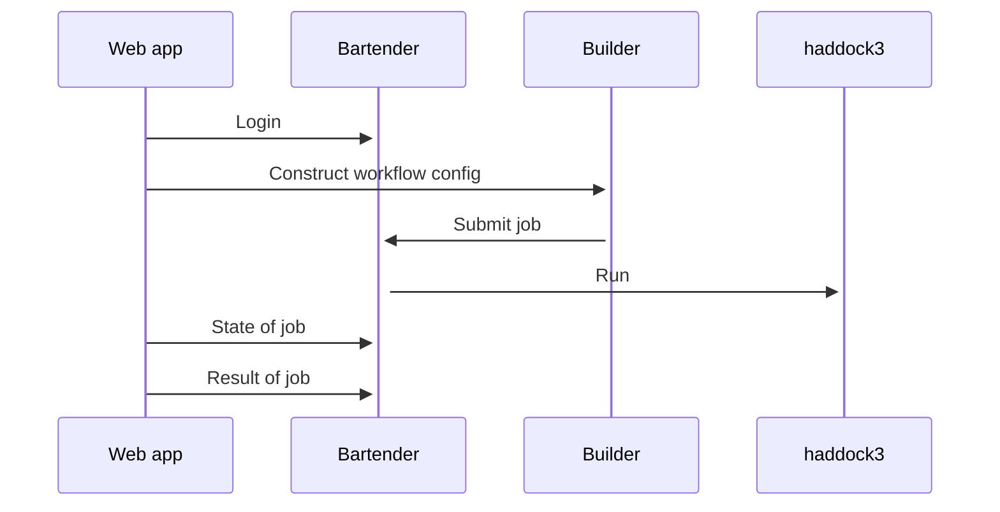

# Web application for haddock3

Uses 
* [bartender](https://github.com/i-VRESSE/bartender) for user and job management.
* [workflow-builder](https://github.com/i-VRESSE/workflow-builder) to construct a Haddock3 workflow config file.
* [haddock3](https://github.com/haddocking/haddock3) to compute



- [Remix Docs](https://remix.run/docs)

## Development

From your terminal:

```sh
npm run dev
```

This starts your app in development mode, rebuilding assets on file changes.

## Deployment

First, build your app for production:

```sh
npm run build
```

Then run the app in production mode:

```sh
npm start
```

Now you'll need to pick a host to deploy it to.

### DIY

If you're familiar with deploying node applications, the built-in Remix app server is production-ready.

Make sure to deploy the output of `remix build`

- `build/`
- `public/build/`

### Using a Template

When you ran `npx create-remix@latest` there were a few choices for hosting. You can run that again to create a new project, then copy over your `app/` folder to the new project that's pre-configured for your target server.

```sh
cd ..
# create a new project, and pick a pre-configured host
npx create-remix@latest
cd my-new-remix-app
# remove the new project's app (not the old one!)
rm -rf app
# copy your app over
cp -R ../my-old-remix-app/app app
```

## Bartender web service client

This web app uses a client to consume the bartender web service.

The client can be (re-)generated with

```shell
npm run generate-client
```
(This command requires that the bartender webservice is running at http://localhost:8000)

## Bartender web service configuration

### Social login

To enable GitHub or Orcid login the bartender web service needs following environment variables.

```shell
BARTENDER_GITHUB_REDIRECT_URL="http://localhost:3000/auth/github/callback"
BARTENDER_ORCIDSANDBOX_REDIRECT_URL="http://localhost:3000/auth/orcidsandbox/callback"
BARTENDER_ORCID_REDIRECT_URL="http://localhost:3000/auth/orcid/callback"
```

Where `http://localhost:3000` is the URL where the Remix run app is running.

## Haddock3 application 

This web app expects that the following application is registered in bartender web service.

```yaml
applications:
    haddock3:
        command: haddock3 $config
        config: workflow.cfg
        allowed_roles:
            - haddock3:easy
            - haddock3:expert
            - haddock3:guru
```

This allows the archive generated with the workflow builder to be submitted.

The user can only submit jobs when he/she has any of thee allowed roles.
A super user should assign a role to the user at http://localhost:3000/admin/users.
A super user can be made by running `bartender super <email>`.

## Catalogs

This repo has a copy (`./app/catalogs/*.yaml`) of the [haddock3 workflow build catalogs](https://github.com/i-VRESSE/workflow-builder/tree/main/packages/haddock3_catalog/public/catalog).

To fetch the latest catalogs run

```shell
npm run catalogs
```
