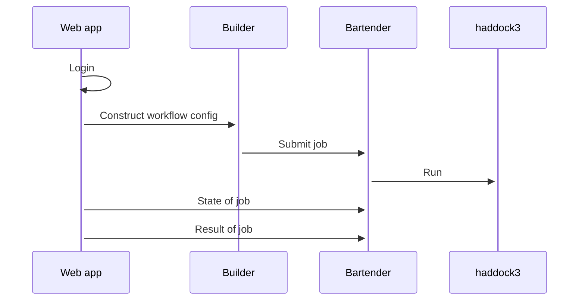

# Web application for haddock3

[](https://research-software-directory.org/software/haddock3-webapp)
[](https://doi.org/10.5281/zenodo.7990850)
[](https://fair-software.eu)

[Haddock3](https://github.com/haddocking/haddock3) (High Ambiguity Driven protein-protein DOCKing) is a an information-driven flexible docking approach for the modeling of biomolecular complexes. This software wraps the the haddock3 command line tool in a web application. The web application makes it easy to make a configuration file, run it and show the results.

Uses

- [bartender](https://github.com/i-VRESSE/bartender) for job execution.
- [workflow-builder](https://github.com/i-VRESSE/workflow-builder) to construct a Haddock3 workflow config file.
- [haddock3](https://github.com/haddocking/haddock3) to compute
- [haddock3-analysis-components](https://github.com/i-VRESSE/haddock3-analysis-components) for analysis components.



## Setup

The web app is written in [Node.js](https://nodejs.org/) to install dependencies run:

```shell
npm install
```

Configuration of the web application is done via `.env` file or environment variables.
For configuration of authentication & authorization see [docs/auth.md](docs/auth.md).
For configuration of job submission see [docs/bartender.md#configuration](docs/bartender.md#configuration).
For configuration of how to rewrite the submitted workflow file see [docs/reewite.md](docs/reewite.md).
Use [.env.example](./.env.example) as a template:

```shell
cp .env.example .env
# Edit .env file
```

Create rsa key pair for signing & verifying JWT tokens for bartender web service with:

```shell
openssl genpkey -algorithm RSA -out private_key.pem \
    -pkeyopt rsa_keygen_bits:2048
openssl rsa -pubout -in private_key.pem -out public_key.pem
```

## Bartender web service

The bartender web service should be running if you want to submit jobs.
See [docs/bartender.md](docs/bartender.md) how to set it up.

## Development

You need to have a PostgreSQL database running. The easiest way is to use Docker:

```sh
npm run docker:dev
```

(Stores data in a Docker volume)
(You can get a psql shell with `npm run psql:dev`)
(On CTRL-C the database is stopped. To remove container and volume use `docker compose `)

The database can be initialized with

```sh
npm run setup
# This will generate prisma client, create tables and insert seed data
```

(You can reset database with `npx prisma migrate reset`.)

The database setup should be run only once for a fresh database.
Whenever you change the `prisma/schema.prisma` file you need to

1. Use [prisma migrate](https://www.prisma.io/docs/concepts/components/prisma-migrate) to generate a migration and to update the database.
2. Run `npx prisma generate` to generate the prisma client.

Start [remix](https://remix.run) development server from your terminal with:

```sh
npm run dev
```

This will refresh & rebuild assets on file changes.

## Other development commands

To format according to [prettier](https://prettier.io) run

```sh
npm run format
```

It's recommended to install an editor plugin (like the [VSCode Prettier plugin](https://marketplace.visualstudio.com/items?itemName=esbenp.prettier-vscode)) to get auto-formatting on save.

To lint according [eslint](https://eslint.org) run

```sh
npm run lint
```

To check the Typescript types run

```sh
npm run typecheck
```

To run unit tests (`app/**/*.test.ts`) with [Vitest](https://vitest.dev) use

```sh
# In watch mode
npm run test
# or in single run mode with coverage
npm run test -- run --coverage
```

## Deployment

First, build your app for production:

```sh
npm run build
```

Then run the app in production mode:

```sh
npm start
```

The web application can be run inside a Docker container together with all its dependent containers, see [docs/docker.md](docs/docker.md).

## Stack

The tech stack is explained in [docs/stack.md](docs/stack.md).
