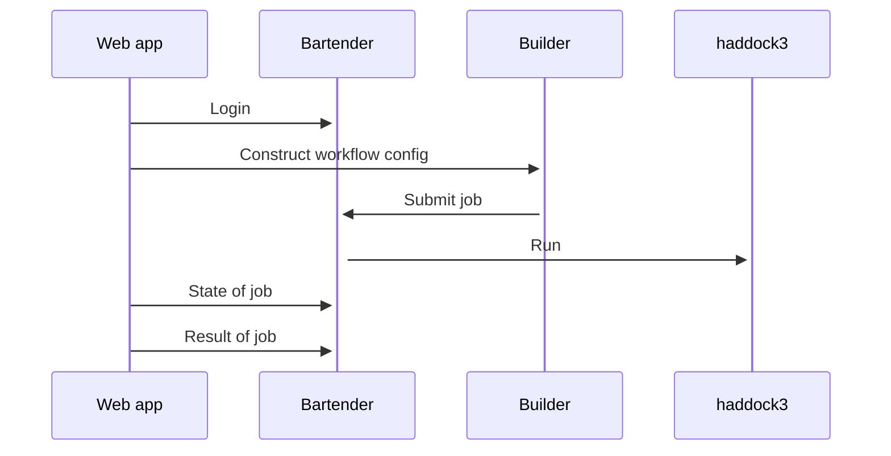

# Web application for haddock3

Uses 
* [bartender](https://github.com/i-VRESSE/bartender) for user and job management.
* [workflow-builder](https://github.com/i-VRESSE/workflow-builder) to construct a Haddock3 workflow config file.
* [haddock3](https://github.com/haddocking/haddock3) to compute



- [Remix Docs](https://remix.run/docs)

## Development

From your terminal:

```sh
npm run dev
```

This starts your app in development mode, rebuilding assets on file changes.

## Deployment

First, build your app for production:

```sh
npm run build
```

Then run the app in production mode:

```sh
npm start
```

Now you'll need to pick a host to deploy it to.

### DIY

If you're familiar with deploying node applications, the built-in Remix app server is production-ready.

Make sure to deploy the output of `remix build`

- `build/`
- `public/build/`

### Docker

The web application can be run inside a Docker container.

Requirements:
1. [bartender repo](https://github.com/i-VRESSE/bartender) to be cloned in `../bartender` directory.
2. bartender repo should have [.env file](https://github.com/i-VRESSE/bartender/blob/main/docs/configuration.md#environment-variables)
3. bartender repo should have a [config.yaml file](https://github.com/i-VRESSE/bartender/blob/main/docs/configuration.md#configuration-file)

Build with

```sh
docker compose build
```

Run with
```sh
docker compose up
```

Web application running at http://localhost:8080 .

Create super user with

```sh
# First register user in web application
docker compose exec bartender bartender super <email>
```

## Bartender web service client

This web app uses a client to consume the bartender web service.

The client can be (re-)generated with

```shell
npm run generate-client
```
(This command requires that the bartender webservice is running at http://localhost:8000)

## Bartender web service configuration

### Bartender

The web application needs to know where the [Bartender web service](https://github.com/i-VRESSE/bartender) is running.
Configure bartender location with `BARTENDER_API_URL` environment variable.

```sh
export BARTENDER_API_URL='http://127.0.0.1:8000'
npm start
```

### Social login

To enable GitHub or Orcid login the bartender web service needs following environment variables.

```shell
BARTENDER_GITHUB_REDIRECT_URL="http://localhost:3000/auth/github/callback"
BARTENDER_ORCIDSANDBOX_REDIRECT_URL="http://localhost:3000/auth/orcidsandbox/callback"
BARTENDER_ORCID_REDIRECT_URL="http://localhost:3000/auth/orcid/callback"
```

Where `http://localhost:3000` is the URL where the Remix run app is running.

## Haddock3 application 

This web app expects that the following application is registered in bartender web service.

```yaml
applications:
    haddock3:
        command: haddock3 $config
        config: workflow.cfg
```

This allows the archive generated with the workflow builder to be submitted.
