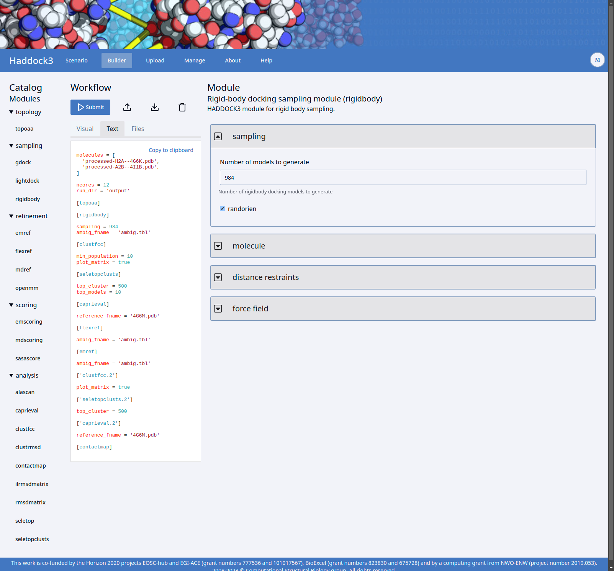

# Demonstration

This a demonstration of the [Antibody-antigen modelling tutorial](https://www.bonvinlab.org/education/HADDOCK3/HADDOCK3-antibody-antigen/), but instead of using the Haddock3 command line interface, we will use the webapp.

This demo must be prepared using the [preparations](PREPARATIONS.md) guide.

From the original tutorial we use scenario 2b: Docking using the paratope and the NMR-identified epitope as active.

We are using Interleukin-1β as antigen and gevokizumab as antibody in this demonstration.
Interleukin-1β plays a central role in the regulation of immune and inflammatory responses.
Gevokizumab inhibits the activity of interleukin-1β.

1. Goto start page at http://localhost:8000
2. Goto scenarios page
3. Goto Antibody-antigen scenario page
4. For antibody
5. Upload `./input/4G6K.pdb` file
6. Select chain H
7. Import active residues: `31,32,33,34,35,52,54,55,56,100,101,102,103,104,105,106,1031,1032,1049,1050,1053,1091,1092,1093,1094,1096`,
  these residues are the highly variable loops of the antibody also known as the paratope aka the region that binds the antigen. Residues predicted with [ProABC-2](https://github.com/haddocking/proabc-2), a deep learning framework to predict antibody paratope residues.
8. For antigen
   1. Upload `./input/4I1B.pdb`
   2. Import active residues: `72,73,74,75,81,83,84,89,90,92,94,96,97,98,115,116,117`, these residues are the NMR-identified epitope residues of the antigen (table 5 of https://dx.doi.org/10.1016/j.jmb.2012.09.021). The epitope is the region that binds to an antibody.
9. For reference structure upload `./input/4G6M.pdb` file. The reference structure is a PDB file with the antibody and antigen docked together.
10. Refine in builder

Do not submit as this will render laptop unusable for a while.

1. Goto http://localhost:8000/jobs
2. Open job named `antibody-antigen-completed`
3. Goto report page,
4. Goto browse page

TODO add conclusion adapted from original tutorial here

## Features

Features of the web application that are nice to show off.

### Scenario page

- Processes the PDB files for you
  - Select chain
  - Compute suface residues
  - Compute restraint to keep chain together
- Choose how use selected residues as restraints
  - Treat all surface residues as passive residues
  - Passive and/or Passive
  - Treat surface neighbours as passive residues
- Select residues in 3 different but syncronized ways
  - Select residues in a 3D viewer
  - Select residues in a sequence viewer
  - Import a list of numbers
- Change settings
  - Surface cutoff
  - Neighbour radius
  - 3D Render style

### Workflow builder

Instructions

Sceenshot can be replicated by either uploading [input/antibody-antigen-workflow.zip](./input/antibody-antigen-workflow.zip) or clicking edit in the browse page of the completed job, followed by clicking on text tab and clicking on `[rigidbody]` text and expanding sampling section.

For users that want to start from scratch or just want to change some parameters in a workflow generated by a scenario.

When you leave workflow builder page, any progress is saved and can be continued later.

- Haddock3 always requires one or more input molecules as pdb files
- To add nodes: Drag and drop modules from left to middle panel or click on it to append
- Switch between a list of modules or the text representation of the workflow click on the Visual/Text tabs.
- Standalone: Can used to construct a workflow, download it and run it yourself with the Haddock3 CLI.

#### Form and text synchronization

1. Select rigibody module
2. Expand sampling
3. Change to text tab
4. Change number of models to generate to 2000

See how form and text visualization are synchronized.

### Report page

A completed job willl show the output of last caprieval module.
The clusters are shown in a table with all their scores and the top 4 structures. For the Haddock3 score the more negative the better.

Where chain A, the antibody, is colored in red and chain B, the antigen, is colored in blue.

The CAPRI Evaluation module uses the Haddock3 scoring function to score the structures and/or clusters.
CAPRI is a community wide yearly benchmark for docking methods.

To zoom in on a chart, select it in the pulldown.

### Browse page

The browse page shows the output of all the modules.
If the submitted workflow did not have a caprieval module the the browse page is shown.

You can 
1. download parts of the jobs like best ranked structures or the whole job.
2. browse the output files
3. for some modules, rerun or look at their reports with plots.

#### Re-running module

By clicking on wrench icon of last caprieval module.

After you change the "Weight of the intermolecular electrostatic energy" to 0.8 and press rescore button, the re-computed HADDOCK3 scores are shown.
The second best cluster has changed.

#### Contactmap report

By clicking on yellow triangle of the contactmap module to see the report.

Shows per cluster how chain A and B are likely contacting each other.

#### Edit

If you found looking at the results that you want use a slightly different workflow, you can edit the job and resubmit it.

An uploadied completed job can not be edited. So use an actual locally run job if you want to show that off.

#### Alascan report

This module is not part of the antibody-antigen scenario. It is part of the refine scenario, which can be run with https://github.com/haddocking/haddock3/blob/main/examples/docking-protein-protein/data/e2a-hpr_1GGR.pdb as molecules and reference structure input. 

This input will show for residue what the impact of a mutation would be.

Also shows the energy difference between the wild type and the mutant for each structure.

Module will mutate the interface residues and calculate the energy differences between the wild type and the mutant, thus providing a measure of the impact of such mutation.

#### Cluster report

By clicking on chart icon of the 07 clustfcc module to see the report.

Plot of distance matrix, you can see the 11 clusters from the report page back here.

Any reports generated by haddock3 cli can also be shown in the webapp in a new window.

## Talking points

### What is HADDOCK?

Is software that tries to figure out how 2 or more molecules can fit together using information to tell which parts are important.

HADDOCK (High Ambiguity Driven protein-protein DOCKing) is an information-driven flexible docking approach for the modeling of biomolecular complexes.

HADDOCK distinguishes itself from ab-initio docking methods in the fact that it encodes information from identified or predicted protein interfaces in ambiguous interaction restraints (AIRs) to drive the docking process. It also allows to define specific unambiguous distance restraints (e.g. from MS cross-links) and supports a variety of other experimental data including NMR residual dipolar couplings, pseudo contact shifts and cryo-EM maps.
HADDOCK can deal with a large class of modeling problems including protein-protein, protein-nucleic acids and protein-ligand complexes, including multi-bodies (N>2) assemblies.

### Usage of software

The HADDOCK2 web application has on average 100 jobs per day and over 50.000 registered users.
See https://rascar.science.uu.nl/stats

### HADDOCK3 vs HADDOCK2

1. HADDOCK3 is open source and HADDOCK2 could on request be run locally on command line
2. HADDOCK3 is a complete rewrite of HADDOCK2
3. HADDOCK3 is more modular and flexible, while HADDOCK2 can do one workflow
4. HADDOCK3 workflow aka configuration file is in toml format
5. HADDOCK3 accepts modules from the community
6. HADDOCK3 has analyis modules, while in HADDOCK3 they where part of the web application

### HADDOCK3 web application vs HADDOCK2 application

The HADDOCK2 web application at https://rascar.science.uu.nl/haddock2.4/ only allows for docking.
With HADDOCK3 web application you can still do docking, but also pick from several other scenarios or build a workflow from scratch.

The HADDOCK3 web application can be run by anyone, while the HADDOCK2 web application is only available to the BonvinLab.
Pharmaceutical companies can run their own HADDOCK3 web application and their data can stay on their own network.

### Re-usablity of software

1. The workflow builder is a seperate piece of software that can be used in other projects to make a configuration file. You just need defined a JSON schema for the modules/nodes and use TOML format for the workflow output. See https://github.com/i-VRESSE/workflow-builder
2. The jobs are executed by the bartender web service, which written in Python and can handle running jobs in a locally, pilot job system, slurm batch scheduler or on the grid using DIRAC. See https://i-vresse-bartender.readthedocs.io/
3. Generic UI components are in own package called [haddock3-ui](https://github.com/i-VRESSE/haddock3-ui). The HADDOCK3 CLI also uses this package to render clusters.
4. Testing running jobs on Slurm or Dirac can be done with the [Xenon docker images](https://github.com/xenon-middleware/xenon-docker-images).

### Implementation details

See https://github.com/i-VRESSE/haddock3-webapp?tab=readme-ov-file#web-application-for-haddock3 for
building blocks and how they are connected.
